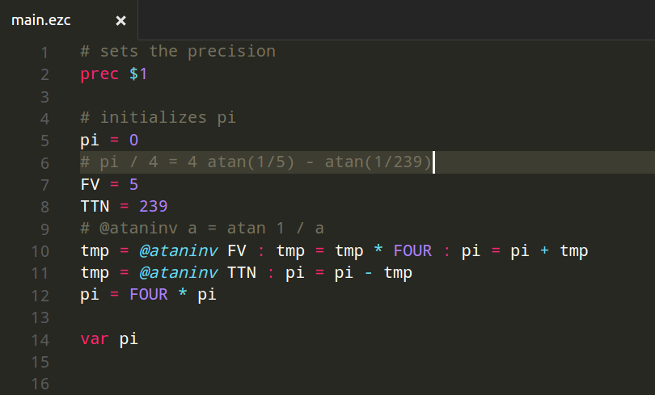

# EZC

"You don't know SRP unless you know EZC"

Current version: 2.3.0

A intermediate language which is transpiled to C. Multiprecision is built into the language.

Made for people who don't want to use low level memory management, but want the speed it provides.

Also, it strictly enforces SRP (or single responsibility principal).

You can think of it like a calculator language, but with more functions and more digits

[Chemical Development Docs](http://chemicaldevelopment.us/docs/ezc/) is the documentation for EZC

# Installation

For any debian based system, simply run 

`curl https://raw.githubusercontent.com/ChemicalDevelopment/ezc/master/install-debian.sh | sh -`

or, try this one if the above doesn't work: 

`curl https://rawgit.com/ChemicalDevelopment/ezc/master/install-debian.sh | sh -`

in the terminal to install

If that doesn't work, go to the [latest release](https://github.com/ChemicalDevelopment/ezc/releases/latest), and download the .deb file, and double click it

For mac OS, you will need to clone and run `./install-legacy.sh` as descibed below

For other OSs, I'm working on packaging systems. For now, you can build them following below:

# Building

You'll need a few prerequisites: `gcc`, and `mpfr` (which should be taken care of when you use `install-legacy.sh` for Debian/MacOS)

For Debian/Ubuntu/MacOS, run `./install-legacy.sh` to build and install

For all OSs:

First, clone this repository:

`git clone https://github.com/ChemicalDevelopment/ezc.git`

Then, run `./ezcc` and assure that no errors were produced. If the were, please create and [Issue](https://github.com/ChemicalDevelopment/ezc/issues)

Now, run `sudo ./install-legacy.sh`. If you get permissions errors, run `./install-legacy.sh ~/ezc/ none`. If you use the second one, when I use `ezcc`, just replace it with `~/ezc/ezcc`

To test it, run `ezcc examples/pi/main.ezc example/pi/ataninv.ezc -o pi.o` (or `~/ezc/ezcc.py examples/pi/main.ezc example/pi/ataninv.ezc -o pi.o`) 

After this, run `./pi.o 1024` and it should print out 1024 bits of pi (3.14159265358979...)

# Examples

To compute pi, simply run:

`echo "i = acos -1.0 : var i" | ezcc -e`

or, 

`ezcc -c "i = acos -1.0 : var i"`

Using `-c` or `-e` means you don't need a file, but c reads from the next argument, and e reads from stdin

# Support

Tested on Ubuntu 15.04, should work for all Linux/Unix distros.

Works on OSX

# Syntax highlighting

For Sublime text, use the included `ezc.tmLanguage` file.

For Visual Studio Code, run `CTRL+SHIFT+P` and type in `install extensions`. Search for `ezc`. Click install, and when you restart code, all .ezc files will have formatting

For any other text editor, look up how to install .tmLanguage files (most support tmLanguage)

# Documentation

[Chemical Development Docs](http://chemicaldevelopment.us/docs/ezc/) is the documentation for EZC

# Running

use it like: `./ezcc $file $file1 . . . -o $output`. Then, run `./$output`

You can define methods, just check

# Documentation

[Functions](http://chemicaldevelopment.us/docs/ezc/functions) for more about functions and statements

Check [examples](https://github.com/ChemicalDevelopment/ezc/tree/master/examples), 

or [docs examples](http://chemicaldevelopment.us/docs/ezc/examples) for the docs

# Tutorials

[Chemical Development Docs](http://chemicaldevelopment.us/docs/ezc/) is the documentation for EZC,

and a tutorial is located at [docs tutorial](http://chemicaldevelopment.us/docs/ezc/tutorials)
